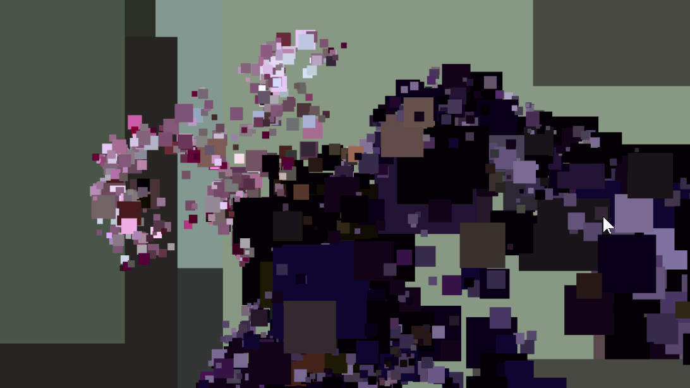

# WebGPU Gaussian Splatting
3D Gaussian splatting renderer and viewer in WebGPU.

**Author:** Lu M.
- [LinkedIn](https://www.linkedin.com/in/lu-m-673425323/)
- [Personal Site](lu-m-dev.github.io)

**Tested System:**
 - Windows 11 Home
 - AMD Ryzen 7 5800HS @ 3.20GHz, 16GB RAM
 - NVIDIA GeForce RTX 3060 Laptop GPU 6GB (Compute Capability 8.6)
 - Brave 1.83.118 (Official Build) (64-bit), Chromium: 141.0.7390.108

## Abstract

Gaussian splatting is a point-based rendering technique where each 3D point is rasterized as a screen-space Gaussian instead of a single pixel. Each splat carries a position, covariance, and color. When splats overlap, their contributions are composited to reconstruct a smooth, continuous appearance.

## Methods

This implementation follows three main stages: preprocess, sort, and render. Each stage is WebGPU-parallelized.

### Preprocess

- Input a 3D point-cloud loaded from a PLY.
- Transform points into view, clip and NDC coordinates.
- Compute per-point splat parameters: positions, 3D covariance, 2D covariance.

### Sort

- Purpose: sorting points back-to-front is required for correct alpha blending and improved memory coherence.
- Implementation: a GPU radix sort.

### Render

- Two renderers are provided:
  - Point-cloud renderer: renders raw points with a simple size and per-point color. This uses a minimal vertex/fragment pipeline.
  - Gaussian splat renderer: for each splat, a screen-space quad is rasterized and shaded with a precomputed Gaussian weight using the splat covariance and color. The fragment shader evaluates the color and opacity.

## Visual comparison

### Bonsai (272,965 points)

<table>
  <tr>
    <th>Point Cloud Renderer</th>
    <th>Gaussian Splatting</th>
  </tr>
  <tr>
    <td></td>
    <td></td>
  </tr>
  <tr>
    <td style="text-align:center">272,965 points — point renderer</td>
    <td style="text-align:center">272,965 points — gaussian splatting</td>
  </tr>
</table>

Observation: for the bonsai dataset (272,965 points) both renderers saturate the display refresh on the test laptop and hit the monitor's 144 Hz cap in the author's measurements.

### Bicycle (1,063,091 points)

<table>
  <tr>
    <th>Point Cloud Renderer</th>
    <th>Gaussian Splatting</th>
  </tr>
  <tr>
    <td></td>
    <td></td>
  </tr>
  <tr>
    <td style="text-align:center">1,063,091 points — point renderer</td>
    <td style="text-align:center">1,063,091 points — gaussian splatting</td>
  </tr>
</table>

Measured performance (personal laptop):

- Bonsai (272,965 points): both renderers hit the display cap at 144 Hz.
- Bicycle (1,063,091 points): point-cloud renderer ≈ 100 Hz; Gaussian splatting renderer ≈ 44 Hz.

Discussion: the Gaussian splatting renderer rasterizes a screen-space quad per point and evaluates a Gaussian per-fragment. For dense clouds (the bicycle set) this produces significantly more fragment shader work and overdraw compared to rendering simple points. For the bonsai dataset the total fragment workload is low enough that both appear similarly fast.

Note: these are preliminary numbers from a single machine. More comprehensive benchmarking is required (different GPUs, tile-based profiling, memory bandwidth counters, and varying splat sizes) to draw robust conclusions.

## Bloopers
### Incorrect depth and sort buffer
<div style="text-align:center">

</div>
I implemented incorrect depth calculation and improper sort buffer usage. This resulted in the output displaying Gaussian quads refreshing with black square artifacts that obscured the view.

### Mistaken opacity
<table>
  <tr>
    <th>Bonsai</th>
    <th>Bicycle</th>
  </tr>
  <tr>
    <td></td>
    <td></td>
  </tr>
</table>
I implemented wrong alpha calculation in the fragment shader, mistakenly assigning an arbitrary value of `1.0f` to all fragments. This gave the air around the object an opacity coherent with the object's color.

## Build instructions

1) Download [Node.js](https://nodejs.org/en/download)

2) Clone repository
    ```cmd
    git clone https://github.com/lu-m-dev/WebGPU-gaussian-splatting.git
    ```

3) Install dependencies
    ```cmd
    cd WebGPU-gaussian-splatting
    npm install
    ```

3) Launch dev server
    ```cmd
    npm run dev
    ```
    Optional build to static `dist/`
    ```cmd
    npm run build
    ```

### Credits

- [Vite](https://vitejs.dev/)
- [tweakpane](https://tweakpane.github.io/docs//v3/monitor-bindings/)
- [stats.js](https://github.com/mrdoob/stats.js)
- [wgpu-matrix](https://github.com/greggman/wgpu-matrix)
- Special Thanks to: Shrek Shao (Google WebGPU team) & [Differential Guassian Renderer](https://github.com/graphdeco-inria/diff-gaussian-rasterization)
